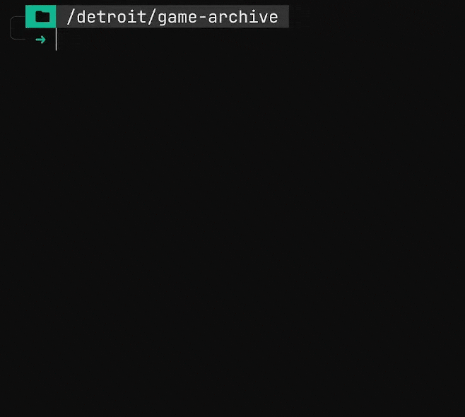

# bsrc
> short for "bespoke search"

A customizable file search utility!

🦀 written in Rust

<p align="center">
  
</p>

## Elevator pitch

Native OS file searching is slow, unordered, and difficult to customize. bsrc solves all of that.

bsrc searches for file/directory names using a regex pattern, _only_ in paths defined in a TOML config file (see: [Configuration](#config)). This results in fast, inexpensive, and uncluttered searches!

bsrc's suite of command line options also let you customize search and output behavior on the fly.

bsrc is especially great for large archives or libraries of games, music, or books!

## Features

+ Regular expression support
+ Remote file system queries with `-r/--remote`
+ Customizable output formats and search behavior

## Building

To manually build the project, you must first [install Rust](https://www.rust-lang.org/tools/install).

Once you have Rust installed, run the following commands:

```bash
$ git clone https://github.com/massivebird/bsrc
$ cd bsrc

$ cargo run           # unoptimized build
# OR
$ cargo run --release # optimized build
```

### Adding bsrc to your PATH

If you want to add bsrc to your PATH, I recommend building it in release mode for better optimization.

```bash
$ cd bsrc
$ cargo build --release
$ ln -rs ./target/release/bsrc <dir-in-PATH>/bsrc
$ bsrc
```

<h2 id="config">Configuration</h2>

bsrc is configured with `bsrc.toml`.

Here is an example configuration:

```toml
# ./archive/bsrc.toml

# Optional: remove pattern from match names.
# e.g. '\(.*\)' produces "Metal (USA, EUR)" -> "Metal"
clean = '\(.*\)' 
                 
# Optional: ignore files based on a regex pattern.
# e.g. '^\.' prevents matching files like `.bios`
ignore = '^\.'

# Optional: custom output format.
# `%p`: prefix
# `%f`: matching filename
output_fmt = '%p :: %f'

[dirs.snes] # dirs.<unique-id>
prefix = "SNES"
path = "snes"
color = "#5930cc"  # Optional: prefix color in hex format
match_dirs = false # Optional: if true, matches directories instead of files
extension = "snes" # Optional: files must have this extension to match

[dirs.wii]
prefix = "WII"
path = "wbfs"
color = "#0cab30"
match_dirs = false
```

### Presets

Presets are shortcuts to your directories that contain a `bsrc.toml`! See: `-p/--preset`.

Remote presets define `user` and `host` credentials for SSH public key authentication.

```toml
# $HOME/.config/bsrc/presets.toml

# All presets are defined with `[presets.<id>]`.
# Use a preset with `-p/--preset <id>`.

# Local preset, path only
[presets.movies]
path = "/home/user/movies/"

# Remote preset, with user@host creds
[presets.games]
host = "192.168.x.xxx"
user = "user"
path = "/H:/game-archive/" # Windows file system path
```
